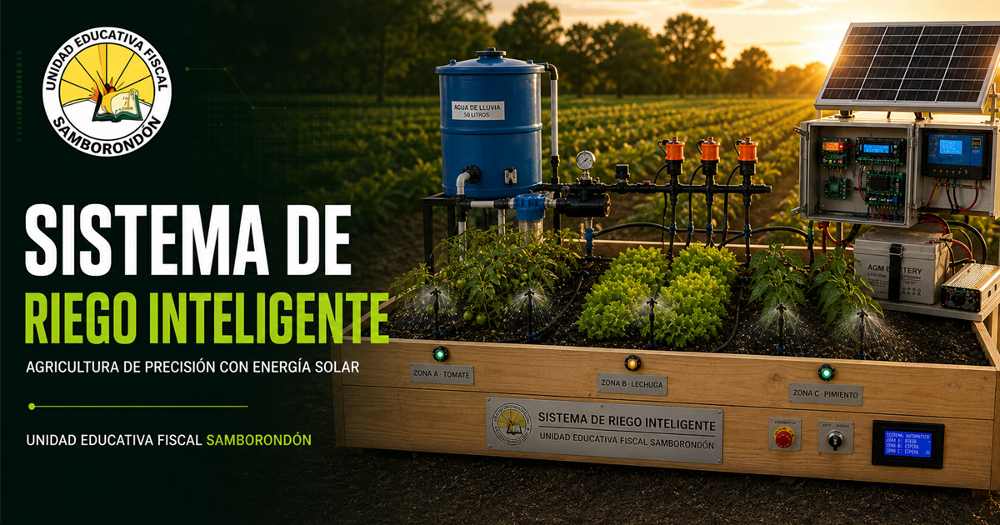

# Sistema de Riego Inteligente

Sitio web oficial del proyecto educativo de la **Unidad Educativa Fiscal Samborondón**. Presenta un prototipo autónomo de agricultura de precisión, construido sobre una cama de cultivo de **1 × 2 metros**, alimentado con energía solar y supervisado mediante una aplicación web.



## Experiencia web

- Portada institucional premium inspirada en la identidad visual del proyecto.
- Monitoreo interactivo de tomate, lechuga y pimiento.
- Simulación de humedad, prioridad hídrica y ciclos automáticos o manuales.
- Catálogo técnico con búsqueda, filtros y fichas de componentes.
- Arquitectura completa de energía, control, sensores, hidráulica y web.
- Guía de instalación en ocho fases.
- Galería ampliable con las diez imágenes finales del proyecto.
- Simulador conceptual de escalabilidad hasta 200 hectáreas.
- Descarga del informe general en Word.

## Arquitectura del prototipo

- **Control:** ESP32, ADS1115, RTC DS3231, microSD y pantalla LCD.
- **Sensores:** humedad y temperatura por zona, ambiente, nivel, caudal, presión y corriente.
- **Actuación:** una bomba de diafragma de 12 V, tres electroválvulas y seis microaspersores.
- **Energía:** panel solar, controlador de carga, batería AGM elevada, distribución DC protegida y convertidor de 5 V.
- **Hidráulica:** tanque de 40–60 L, filtro de 120 mesh, retención, medición y colector de tres vías.
- **Interfaz:** control local autónomo y supervisión web responsiva.

## Desarrollo local

Requiere Node.js `>=22.13.0`.

```bash
npm install
npm run dev
```

Validación:

```bash
npm run lint
npm test
```

Sitio publicado: [sistema-riego-inteligente-samborondon.eemite.chatgpt.site](https://sistema-riego-inteligente-samborondon.eemite.chatgpt.site)

---

**Unidad Educativa Fiscal Samborondón · Samborondón, Ecuador · 2026**
