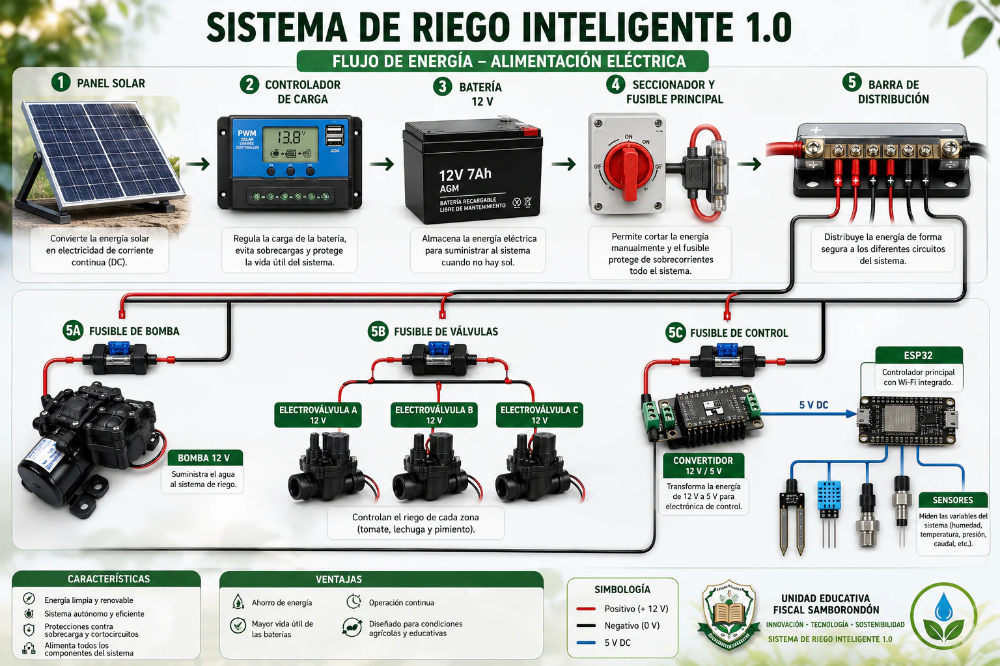
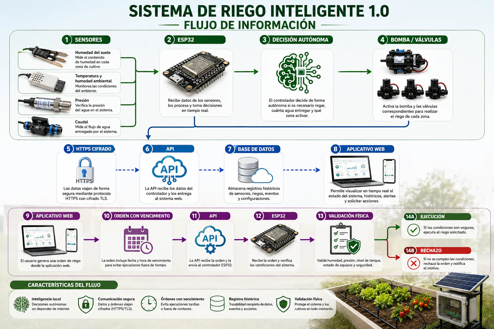
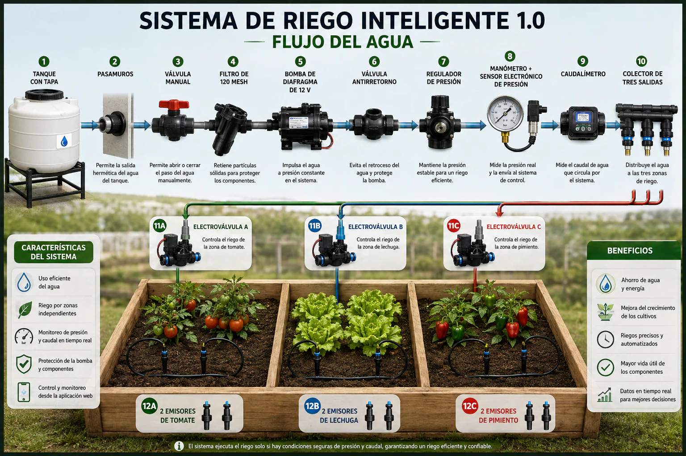

# Sistema de riego inteligente 1.0

## Informe técnico integral y guía de implementación

**Institución:** Unidad Educativa Fiscal Samborondón  
**Lugar:** Samborondón, Ecuador  
**Versión del documento:** 1.0  
**Fecha:** 16 de agosto de 2026  
**Estado:** diseño técnico, software y documentación listos para implementación y validación física

---

# 1. Resumen ejecutivo

El Sistema de riego inteligente 1.0 es un prototipo educativo, autónomo, solar y conectado para una cama agrícola de 2,00 × 1,00 m dividida en tres zonas: tomate, lechuga y pimiento. Su controlador ESP32 mide humedad y temperatura del suelo, condiciones ambientales, nivel del tanque, caudal, presión, tensión de batería y producción solar. A partir de esas mediciones decide localmente si es necesario y seguro regar.

El agua se impulsa mediante una bomba de diafragma de 12 V y se entrega por tres electroválvulas normalmente cerradas, una por zona, con dos emisores regulables en cada cultivo. El suministro eléctrico se basa en un panel solar de 150 W, controlador de carga y batería AGM de 12 V y 55 Ah. Los circuitos de bomba, válvulas y control poseen protecciones independientes.

El aplicativo web permite observar el estado, revisar históricos, comprender por qué el sistema actúa y solicitar riegos remotos. La web no gobierna directamente las cargas: crea una solicitud con vencimiento y el ESP32 vuelve a comprobar todas las condiciones físicas. La pérdida de Internet no impide la operación autónoma.

El proyecto solo se declara completamente operativo después de instalar el hardware real, sustituir las constantes de ejemplo por calibraciones medidas, aprobar las 21 pruebas de aceptación, operar 72 horas sin fallos y completar un ensayo documentado de siete días.

# 2. Problema, justificación y alcance

## 2.1 Problema que atiende

El riego manual depende de horarios fijos y observación humana, puede entregar más o menos agua de la necesaria y no deja evidencia confiable de volumen, presión, fallos o consumo energético. En un entorno educativo también dificulta relacionar agricultura, electrónica, programación, energía renovable y análisis de datos.

## 2.2 Justificación

El prototipo permite demostrar un ciclo tecnológico completo: medición, decisión, actuación, verificación, registro y supervisión. El uso de energía solar reduce dependencia de la red; el control por volumen mejora la trazabilidad del agua; y las protecciones físicas y lógicas enseñan que la automatización responsable necesita estados seguros y evidencia.

## 2.3 Alcance de la versión 1.0

- Cama agrícola de 2,00 × 1,00 m y tres zonas independientes.
- Cultivos demostrativos: zona A tomate, zona B lechuga y zona C pimiento.
- Un tanque opaco de 40–60 L y una bomba central de 12 V.
- Tres electroválvulas NC y seis microaspersores regulables.
- Control local con ESP32, medición completa y operación sin Internet.
- Energía solar con panel de 150 W y batería AGM de 12 V y 55 Ah.
- API HTTPS, base de datos, auditoría y aplicativo web.
- Lista maestra de compra, montaje, calibración, mantenimiento y aceptación.

## 2.4 Exclusiones

La versión 1.0 no es un sistema de riego agrícola de gran escala, no controla fertilización química, no sustituye recomendaciones agronómicas y no puede considerarse instalado o certificado únicamente porque el software funcione. El tanque de 2.000 L y la tubería de 25 mm de algunas referencias visuales corresponden a una posible ampliación, no al prototipo escolar.

# 3. Objetivos

## 3.1 Objetivo general

Diseñar e implementar un sistema de riego autónomo y seguro que utilice sensores para decidir el riego de tres cultivos, energía solar para sostener la operación y un aplicativo web para supervisión, registro y solicitudes remotas protegidas.

## 3.2 Objetivos específicos

1. Medir humedad y temperatura de suelo de forma independiente en A, B y C.
2. Medir condiciones ambientales, nivel, presión, caudal, batería y energía solar.
3. Entregar agua por volumen y mantener una única zona activa por vez.
4. Detener el riego ante emergencia, tanque bajo, caudal nulo, presión anormal, batería baja o tiempo máximo.
5. Mantener horarios, límites y decisiones aunque no exista conexión a Internet.
6. Proteger cargas de 12 V y señales de 3,3 V mediante etapas adecuadas.
7. Registrar telemetría, órdenes, resultados y eventos de auditoría.
8. Permitir monitoreo remoto con autenticación, HTTPS y órdenes con vencimiento.
9. Validar el montaje mediante calibraciones y 21 pruebas documentadas.

# 4. Arquitectura y flujos del sistema

## 4.1 Flujo de energía

La ruta oficial es: panel solar de 150 W → controlador de carga compatible con AGM → batería AGM de 12 V y 55 Ah → fusible principal próximo al positivo → seccionador DC → protección de polaridad y barras cubiertas → ramales independientes para bomba, válvulas y control. El ramal de control incorpora fusible y convertidor DC–DC de 12 V a 5 V.

**Aclaración:** la batería de 7 Ah visible en la lámina es ilustrativa. La especificación oficial y obligatoria del proyecto es AGM de 12 V y 55 Ah. Los valores definitivos de fusibles y calibre de cable se confirman con la corriente normal, la corriente de arranque y la caída de tensión del montaje real.

## 4.2 Flujo de información

La ruta de control es: sensores → ESP32 → validación y decisión autónoma → MOSFET/relé → bomba y electroválvulas. En paralelo, el dispositivo envía telemetría por HTTPS a la API, la base de datos conserva históricos y el aplicativo web presenta estado, alertas y decisiones.

Una solicitud remota sigue la ruta: usuario autorizado → aplicativo web → orden con identificador y vencimiento → API → ESP32 → validación física → ejecución o rechazo → acuse y auditoría. La web supervisa y solicita; el controlador local decide.

## 4.3 Flujo del agua

La ruta hidráulica oficial es: tanque con tapa → pasamuros → válvula manual → filtro de 120 mesh → manguera de succión reforzada → bomba de diafragma de 12 V → válvula antirretorno → regulador → manómetro y sensor electrónico de presión → caudalímetro Hall → colector de tres salidas → electroválvula A/B/C → tubería de 16 mm → microtubo de 6 mm → dos emisores por zona.

El sistema abre una sola electroválvula, espera 1,5 s, enciende la bomba y exige pulsos de caudal antes de cinco segundos. Durante el riego controla presión y volumen. Al terminar apaga la bomba, espera 1,5 s, cierra la válvula y registra el resultado.

# 5. Subsistemas y componentes

## 5.1 Kit estructural y cama agrícola

| Elemento | Cantidad | Función y requisito principal |
|---|---:|---|
| Bastidor | 1 | Estructura de 2 × 1 m, altura 35–45 cm, resistente a sustrato saturado. |
| Fijaciones anticorrosivas | 20–40 | Unen el bastidor; incluir tuercas, arandelas y tapas de perfil. |
| Patas niveladoras | 4 | Corrigen irregularidades y mantienen drenaje uniforme. |
| Membrana | 1 pieza | Impermeabiliza fondo y laterales sin quedar perforada. |
| Geotextil y drenante | 1 capa + 3–5 cm | Retienen sustrato y conducen el exceso de agua. |
| Salidas de drenaje | 1–3 | Evitan saturación y descargan lejos de la electrónica. |
| Divisores | 2 | Aíslan las tres zonas para que cada sensor sea representativo. |
| Sustrato | 0,40–0,60 m³ | Medio homogéneo, con composición y profundidad registradas. |
| Soporte técnico y letreros | 1 + 4 | Sostienen caja/hidráulica e identifican proyecto y zonas. |

## 5.2 Kit hidráulico

| Elemento | Cantidad | Función y requisito principal |
|---|---:|---|
| Tanque opaco con tapa | 1 | Reserva lavable de 40–60 L, protegida de contaminación y luz. |
| Válvula de bola y filtro | 1 + 1 | Aíslan el tanque y retienen partículas; filtro lavable de 120 mesh. |
| Bomba de diafragma | 1 | 12 V, autocebante, 3–5 L/min; corriente de arranque conocida. |
| Antirretorno y regulador | 1 + 1 | Mantienen cebado y presión inicial cercana a 1 bar. |
| Manómetro y sensor de presión | 1 + 1 | Diagnóstico independiente y detección electrónica de fuga/bloqueo. |
| Caudalímetro Hall | 1 | Mide aproximadamente 0,5–5 L/min y permite control por volumen. |
| Colector | 1 | Divide la línea en tres salidas. |
| Electroválvulas NC | 3 | Una por zona; 12 V, acción directa o funcionamiento desde 0 bar. |
| PE 16 mm y microtubo 6 mm | 3–4 m + 6–8 m | Línea principal y derivaciones a emisores. |
| Microaspersores y estacas | 6 + 6 | Dos emisores regulables por zona, fuera del chorro directo al sensor. |
| Accesorios y sellado | Según trazado | Tees, codos, reductores, uniones, tapones, empaques, PTFE y clips. |

## 5.3 Kit de sensores y medición

| Elemento | Cantidad | Función y requisito principal |
|---|---:|---|
| Humedad capacitiva | 3 + 1 repuesto | Una sonda encapsulada y calibrada individualmente por zona. |
| ADS1115 | 1 | ADC I²C de 16 bits: A0/A1/A2 humedad y A3 presión. |
| DS18B20 impermeable | 3 + 1 repuesto | Temperatura de suelo con ROM identificada A/B/C y pull-up de 4,7 kΩ. |
| BME280 y garita | 1 + 1 | Temperatura/humedad ambiental, ventilado y en sombra. |
| Ultrasónico impermeable | 1 | Nivel continuo; ECHO adaptado de 5 V a 3,3 V. |
| Flotadores | 2 | Inferior obligatorio para corte y superior para aviso de llenado. |
| INA260 | 1 | Mide tensión, corriente y potencia solar hasta 36 V/15 A; verificar Isc. |
| Divisor de batería | 1 juego | 47 kΩ/10 kΩ, filtrado y calibrado con multímetro. |

## 5.4 Kit de control electrónico

El ESP32 DevKit de 3,3 V y Wi‑Fi de 2,4 GHz es el cerebro local. Ejecuta una máquina de estados, promedia lecturas, calcula déficit, mantiene límites diarios, gobierna salidas por etapas de potencia, conserva datos esenciales en NVS y se comunica con la API. El DS3231 mantiene hora y horarios durante cortes. Una OLED I²C, botones, LED, zumbador, microSD o MCP23017 pueden añadirse, pero son opcionales y exigen revisar pines y firmware.

Pines oficiales: OneWire GPIO 4; caudal GPIO 18; alimentación de sensores GPIO 19; bomba GPIO 25; válvulas A/B/C GPIO 26/27/14; flotador inferior GPIO 33; flotador superior GPIO 23; emergencia GPIO 13; batería GPIO 34; ultrasónico TRIG/ECHO GPIO 32/35; I²C SDA/SCL GPIO 21/22.

## 5.5 Kit de potencia y seguridad

Cuatro MOSFET de canal N con nivel lógico real a 3,3 V accionan bomba y válvulas. Cada carga inductiva requiere diodo de rueda libre dimensionado; las compuertas usan resistencia de 100–220 Ω y pull-down de aproximadamente 10 kΩ cuando el módulo no los incluye. El diseño incorpora parada de emergencia enclavable con contacto NC y corte físico de la bomba, TVS de 12 V, condensadores, convertidor 12→5 V de al menos 3 A y fusibles separados.

Valores iniciales de estudio: control 2 A, válvulas 3–5 A, bomba 7,5–10 A y principal 15 A. Se sustituyen por valores calculados después de medir el hardware. No se conectan cargas de 12 V ni señales de 5 V directamente al ESP32.

## 5.6 Kit de energía solar

El panel de 150 W debe verificarse por Voc, Vmp, Isc e Imp. Se instala con estructura resistente, cable UV y MC4 crimpados. El controlador MPPT, preferible y mínimo de 15 A, se configura para AGM. La batería de ciclo profundo de 12 V y 55 Ah se fija en bandeja con correa, terminales cubiertos, ventilación y separación del agua. Un módem 4G es opcional y obliga a recalcular el presupuesto energético.

## 5.7 Caja, cableado y montaje

La electrónica se aloja en una caja IP65 con placa o riel DIN, borneras, prensaestopas adecuados y separación de potencia, señales analógicas y antena. Referencias iniciales de conductor: 12–14 AWG para batería/bomba, 18 AWG para válvulas y 20–22 AWG para sensores; la sección final se calcula por corriente, distancia y caída de tensión. Todos los cables se identifican en ambos extremos, reciben terminales crimpados y se protegen con termorretráctil y canalización.

## 5.8 Comunicaciones y software

El dispositivo utiliza Wi‑Fi de 2,4 GHz, certificado TLS válido y un token exclusivo almacenado fuera del repositorio. La API recibe telemetría, entrega órdenes, conserva confirmaciones y abastece el panel. La base de datos contiene telemetría, lecturas por zona, configuración, órdenes y auditoría. El aplicativo exige autenticación humana y no muestra secretos del dispositivo.

# 6. Lista de compra resumida y verificaciones previas

La lista completa incluye estructura, hidráulica, control, sensores, potencia, energía solar, caja, cableado, herramientas, consumibles, servicios, repuestos y calibración. Antes de autorizar la compra definitiva se debe:

- Medir o confirmar corriente normal y de arranque de la bomba.
- Confirmar que las electroválvulas abren desde 0 bar y que los emisores trabajan con la presión prevista.
- Verificar Voc e Isc del panel contra controlador, INA260, cable y protecciones.
- Calcular caída de tensión en todos los ramales.
- Confirmar diámetros, roscas, empaques y sentido de flujo.
- Mantener una sola válvula activa por vez.
- Disponer de fusibles, un MOSFET, una sonda de humedad, una DS18B20, emisores, tubería y empaques de repuesto.

# 7. Implementación paso a paso

| Fase | Trabajo principal | Criterio de salida |
|---:|---|---|
| 1 | Responsables, ubicación, inventario, EPP y evidencias | Lugar y seguridad aprobados. |
| 2 | Compra y compatibilidad eléctrica/hidráulica | Ninguna especificación crítica pendiente. |
| 3 | Bastidor, membrana, drenaje, divisores y sustrato | Estructura estable y zonas aisladas. |
| 4 | Tanque, filtro, bomba, medición, colector y emisores | Presión y caudal repetibles, sin fugas. |
| 5 | Panel, controlador, batería, fusibles y distribución | 12 V estable y ramales aislables. |
| 6 | Caja, DC–DC, MOSFET, diodos, emergencia y borneras | Encendido con todas las salidas apagadas. |
| 7 | Sensores, adaptación 3,3 V e identificación | Lecturas plausibles y fallos en estado seguro. |
| 8 | Firmware, API, base de datos y aplicativo | Telemetría y órdenes con acuse. |
| 9 | Calibración de humedad, caudal, presión, tanque y batería | Constantes reales y hoja firmada. |
| 10 | Integración autónoma de tres zonas | Riego por volumen con protecciones activas. |
| 11 | Protocolo de 21 pruebas | 21/21 aprobadas e incidencias cerradas. |
| 12 | Capacitación, entrega y mantenimiento | Operación institucional independiente. |

# 8. Lógica autónoma inicial

| Zona | Inicio orientativo | Pulso | Máximo diario | Estabilización |
|---|---:|---:|---:|---:|
| A — tomate | Humedad < 45 % | 0,40 L | 3,0 L | 15 min |
| B — lechuga | Humedad < 50 % | 0,35 L | 2,4 L | 10 min |
| C — pimiento | Humedad < 44 % | 0,40 L | 2,8 L | 15 min |

Estos valores son puntos de partida. Deben ajustarse al sustrato, etapa de cultivo y criterio agronómico. La secuencia de riego valida emergencia, tanque, batería, sensores, horario y límite; abre una válvula; espera; activa la bomba; exige caudal; vigila presión; detiene por volumen o 120 s; apaga; cierra; registra y entra en estabilización.

# 9. Calibración

## 9.1 Humedad

Tomar al menos 30 muestras en sustrato seco y 30 a capacidad de campo para cada sensor. Utilizar medianas y guardar constantes separadas A/B/C. No calibrar únicamente en aire y agua. Si una sonda falla, se bloquea su zona y no se sustituye su lectura por el promedio de las otras.

## 9.2 Caudal

Recoger al menos 1 L, contar pulsos, repetir tres veces por zona y calcular pulsos/litro. Ajustar hasta que el error medio del volumen sea igual o menor al 10 %. Comprobar nuevamente después de intervenir filtro, bomba, regulador, válvula o emisores.

## 9.3 Presión

Comparar el sensor electrónico con el manómetro en al menos tres puntos. Ajustar cero y escala. Definir límites de baja y alta presión a partir de la condición normal de cada zona y de fallos controlados de fuga y obstrucción.

## 9.4 Tanque y batería

Medir distancias ultrasónicas de lleno y crítico y verificar el flotador inferior de forma independiente. Calibrar tensión de batería con multímetro en 12,0 V, 12,8 V y durante el arranque de la bomba.

# 10. Seguridad, fallos y respuesta

| Condición | Detección | Respuesta segura |
|---|---|---|
| Emergencia o cable abierto | Contacto NC | Corte físico y lógico inmediato. |
| Tanque bajo | Flotador inferior + nivel | Detener bomba y bloquear riego. |
| Caudal nulo | Ausencia de pulsos | Detener en máximo 5 s. |
| Obstrucción | Presión alta | Detener y generar alarma. |
| Fuga o pérdida de cebado | Presión baja/caudal anormal | Detener y solicitar inspección. |
| Sensor de zona inválido | Rango o desconexión | Bloquear solo la zona afectada. |
| Batería baja | Divisor calibrado | Suspender riego y conservar monitoreo si es viable. |
| Internet caído | Temporizador de comunicación | Continuar localmente y reanudar telemetría al volver. |
| Orden vencida o repetida | Fecha e identificador | Rechazar o ejecutar una sola vez. |
| Reinicio | Inicialización | Bomba y válvulas permanecen apagadas. |

# 11. Protocolo de aceptación

| Nº | Prueba | Criterio de aprobación | Resultado |
|---:|---|---|:---:|
| 1 | Diez arranques | Ninguna salida se activa. | ☐ |
| 2 | Emergencia durante riego | Paro inmediato de bomba y válvula. | ☐ |
| 3 | Tanque bajo | No inicia o detiene la bomba. | ☐ |
| 4 | Humedad A/B/C | Lectura coherente; fallo bloquea su zona. | ☐ |
| 5 | Identidad térmica | Cada ROM corresponde siempre a A, B o C. | ☐ |
| 6 | Aislamiento de zonas | Solo abre la válvula solicitada. | ☐ |
| 7 | Aforo por zona | Error medio ≤ 10 %. | ☐ |
| 8 | Caudal nulo | Detención ≤ 5 s. | ☐ |
| 9 | Obstrucción | Presión alta y paro. | ☐ |
| 10 | Fuga controlada | Presión/caudal anormal y paro. | ☐ |
| 11 | Tiempo máximo | La bomba nunca supera 120 s. | ☐ |
| 12 | Límite diario | Rechaza el siguiente pulso. | ☐ |
| 13 | Batería baja | No inicia y genera alarma. | ☐ |
| 14 | Sin Internet durante 2 h | Continúa medición y autonomía. | ☐ |
| 15 | Reconexión | Vuelve la telemetría sin intervención. | ☐ |
| 16 | Orden vencida | No se ejecuta después de 2 min. | ☐ |
| 17 | Orden duplicada | Se ejecuta una sola vez. | ☐ |
| 18 | Acceso no autorizado | API deniega la solicitud. | ☐ |
| 19 | Reinicio durante riego | Salidas apagadas y límite conservado. | ☐ |
| 20 | Operación continua 72 h | Sin bloqueo, fuga ni reinicio inexplicado. | ☐ |
| 21 | Ensayo de siete días | Datos consistentes y disponibilidad ≥ 99 %. | ☐ |

# 12. Operación y mantenimiento

## 12.1 Operación normal

La institución debe revisar el estado autónomo, nivel, batería y alarmas; mantener limpia la zona; reponer agua segura; y usar el riego manual solo como solicitud, nunca como puente de protecciones. La parada de emergencia se utiliza ante fuga importante, olor, calentamiento, cable expuesto, comportamiento inesperado o intervención técnica.

## 12.2 Frecuencias

- **Semanal:** revisar fugas, tapa y nivel, emisores, alarmas y sombra del panel.
- **Mensual:** limpiar filtro y panel, probar emergencia y tanque bajo, revisar bornes y comparar caudales.
- **Trimestral:** repetir aforo y presión, inspeccionar drenaje, probar dos horas sin Internet y buscar corrosión o calentamiento.
- **Anual o al cambiar cultivo/sustrato:** evaluar batería, recalibrar humedad, revisar cables/fusibles y actualizar firmware/certificado de forma controlada.

## 12.3 Evidencia mínima

Conservar inventario, hojas de datos, croquis as-built, fotografías, direcciones ROM, escaneo I²C, constantes, versión de firmware, resultados de aforo, presión, pruebas, incidencias, mantenimiento y responsables. Las credenciales y tokens se entregan por un canal seguro y nunca aparecen en el repositorio.

# 13. Indicadores de éxito

- 100 % de arranques con salidas apagadas.
- Error de volumen ≤ 10 % en cada zona.
- Paro por caudal nulo en ≤ 5 s.
- Cero ejecuciones por encima del máximo diario.
- Operación autónoma durante al menos 2 h sin Internet.
- 100 % de órdenes remotas con identificador, actor, vencimiento y estado final.
- Disponibilidad ≥ 99 % en el ensayo de siete días.
- Ausencia de agua en caja, conductores expuestos, conexiones calientes o protecciones puenteadas.

# 14. Roles sugeridos

| Rol | Responsabilidad |
|---|---|
| Responsable institucional | Autoriza ubicación, acceso, compras y aceptación. |
| Docente responsable | Coordina uso educativo, bitácora y capacitación. |
| Responsable técnico | Valida planos, cálculos, montaje, seguridad y pruebas. |
| Responsable de software | Mantiene firmware, API, base, despliegue y respaldos. |
| Operador | Revisa alarmas, agua, limpieza y mantenimiento rutinario. |
| Estudiantes | Participan bajo supervisión y sin intervenir circuitos energizados. |

# 15. Declaración responsable de operatividad

El repositorio, la aplicación web, la API, el firmware, las imágenes y la documentación conforman una base funcional para construir el proyecto. Sin embargo, ningún documento puede reemplazar la verificación del montaje real. La expresión “100 % funcional y operativo” solo debe utilizarse cuando las calibraciones coincidan con el hardware instalado, las 21 pruebas estén firmadas, no existan puentes temporales y se hayan completado 72 horas continuas y siete días de ensayo.

| Campo | Registro | Campo | Registro |
|---|---|---|---|
| Responsable técnico |  | Docente responsable |  |
| Fecha de aceptación |  | Versión de firmware |  |

# 16. Documentos de soporte del repositorio

- Descripción detallada de todos los componentes.
- Lista maestra de compra.
- Guía de implementación paso a paso.
- Montaje y puesta en marcha.
- Protocolo de 21 pruebas.
- Contrato de comunicación de la API.
- Firmware del ESP32 y configuración de ejemplo.
- Aplicativo web, API y esquema de datos.

## 16.1 Expediente de implementación

| Evidencia | Responsable | Fecha/versión | Ubicación o referencia |
|---|---|---|---|
| Inventario y hojas de datos |  |  |  |
| Plano as-built y tabla de pines |  |  |  |
| Escaneo I²C y direcciones ROM |  |  |  |
| Hoja de calibración |  |  |  |
| Aforos y comparación de presión |  |  |  |
| Resultados de las 21 pruebas |  |  |  |
| Fotografías del montaje final |  |  |  |
| Registro de 72 h y siete días |  |  |  |

## 16.2 Control de revisiones

| Versión | Fecha | Cambio realizado | Responsable |
|---|---|---|---|
| 1.0 | 16/08/2026 | Informe técnico integral inicial | Unidad Educativa Fiscal Samborondón |
